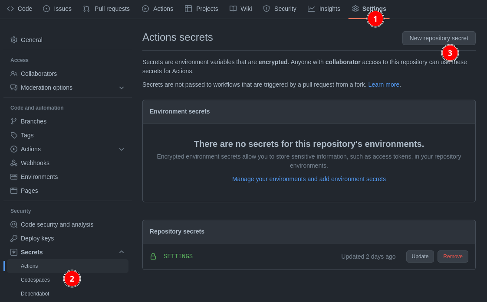
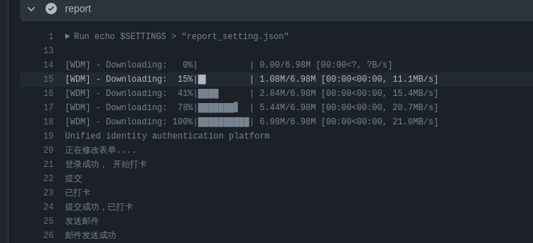
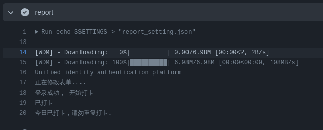

# cqupt每日健康打卡

设置github actions，进行每日打卡。默认每日运行两次。

# Usage

1. fork此仓库
2. 设置账号信息，信息格式参考[exmaple](./example_settings.md)。然后把信息放到secret中，参考如下：

> note: secret名字应该为`SETTINGS`，除非自己更改workflow中的变量。

# 结果图

+ 打卡成功

+ 已打卡

